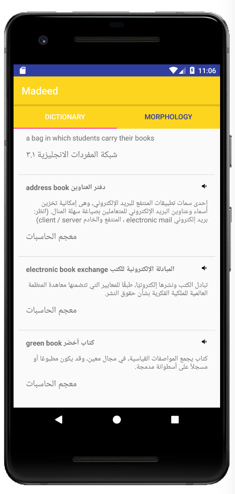
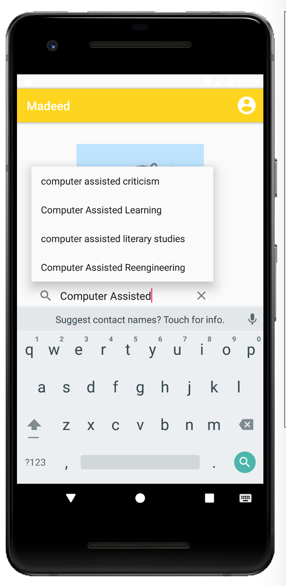

# Madeed مديــــــد

Madeed is a voice-enabled interactive language tool that enables users to translate words and phrases, discover ontological relationships and understand synonyms between Arabic and English text.

Results in Madeed are sourced from over 150 different dictionaries using the largest ontological database currently existing for the Arabic language. Because words are mapped to `ontological` concepts, Madeed is tolerant to the morphological variations in the Arabic language and has been proven to have a better user experience for translators

By bringing the database to mobile and incorporating voice and text to speech, we hope to build an accessible mobile platform that can bridge language and culture across the arab world.

https://docs.google.com/presentation/d/1qi_x6xaXHg1pkCX_gJsBIAxQa7xrWYVA0l463fhfQxs/edit?usp=sharing

---

  
  

